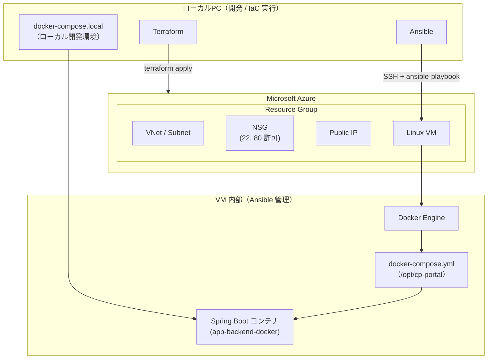

# 「現場向け・工事進捗ポータル（社内Webアプリ）」

## 1. 概要
本プロジェクトは、建設・土木業界の現場業務を建設現場ごとに「工事進捗・写真・メモ」を共有する<br>社内向けWebアプリケーションの構築を目指したものです。環境構築には Terraform（Azure）や Ansible を用い、
クラウド・IaC・コンテナ技術を組み合わせて構築いたしました。

## 2. 使用技術
### 2-1.アプリケーション
・Java 17
・Spring Boot 3
・Maven（ビルド / 依存関係管理）
・Thymeleaf
### 2-2.インフラ
・Azure Virtual Machine（Ubuntu）
・Azure Virtual Network / Subnet
・Azure Network Security Group（NSG）
・Azure Public IP
### 2-3.コンテナ
・Docker / Docker Compose
### 2-4.IaC / 構成管理（Infrastructure as Code）
・Terraform（Azureリソース構築）
・Ansible（VM 構成管理・アプリデプロイ）
### 2-5.補足
Spring Boot + MySQL を Docker で動かし、
Azure 上の VM に Terraform & Ansible で自動構築・デプロイする、
クラウド×アプリ×自動化 を実践したプロジェクトです。

## 3. ディレクトリ構成
```text
construction-progress-portal/
├─ README.md
├─ docs/
│   ├─ overview.md         
│   └─ detail.md           
├─ terraform/              # Azure インフラ（VM / VNet / NSG / Public IP）
│   ├─ provider.tf
│   ├─ main.tf
│   ├─ variables.tf
│   ├─ outputs.tf
│   └─ terraform.tfvars.example
├─ ansible/                # VM 初期設定 + Docker / Compose + 本番コンテナ起動
│   ├─ inventory.ini
│   ├─ site.yml
│   └─ roles/
│       ├─ common/
│       │   └─ tasks/
│       │       └─ main.yml
│       └─ app_compose/
│           ├─ tasks/
│           │   └─ main.yml
│           └─ files/
│               └─ docker-compose.yml   # 本番用 Compose（/opt/cp-portal 用）
├─ app-backend/            # Spring Boot アプリ本体
│   ├─ pom.xml
│   └─ src/ ...
├─ app-backend-docker/     # 本番イメージ用 Dockerfile（マルチステージ）
│   └─ Dockerfile
├─ docker-compose.local.yml # ローカル開発用 Compose
├─ Dockerfile.local         # ローカル開発用 Dockerfile
└─ future-python-worker/    # 将来の Python ワーカー（AI / PDF 等）
    ├─ Dockerfile
    └─ app/
        └─ main.py
```
## 4. Azureシステム構成図


<a target="_blank" href="https://icons8.com/icon/90519/spring-boot">春のロゴ</a> アイコン by <a target="_blank" href="https://icons8.com">Icons8</a>

## 5. 全体アーキテクチャ（高レベル図）

## 実行手順
### 1. ローカル開発
Javaの開発はここで行います。
変更した場合はビルドしてupします。
#### 初回ビルド
docker compose -f docker-compose.local.yml build
#### 初回起動
docker compose -f docker-compose.local.yml up -d

#### 初回起動（ビルド込み）
docker compose -f docker-compose.local.yml up --build
#### 確認
http://localhost:8085/
で動作確認する。
#### 停止
docker compose -f docker-compose.local.yml down

### 2. Terraformによる構築手順（Azure）
Azure CLI 認証
#### 2.1 Terraform ディレクトリへ移動
cd terraform
#### 2.2 Azure CLI でログイン
az login
#### 2.3 使いたいサブスクリプションを選択（必要なら）
##### サブスクリプションのテーブル表示
az account list --output table
##### サブスクリプションのIDを指定して設定
az account set --subscription "SubscriptionId"
##### 現在設定しているサブスクリプションを表示
az account show --output table
#### 2.4 初期化＆実行
##### 初期化
terraform init
##### プラン表示
terraform plan
##### そのプランを実行
terraform apply
確認プロンプトに：yes と入力
##### 出力確認（Outputs）
自動設定されたパブリックIPアドレス
vm_public_ip = "20.xxx.xxx.xxx"
SSH接続用のコマンド
ssh_example  = "ssh azureuser@20.xxx.xxx.xxx"
#### 2.5 Azure ポータルでリソース確認
- cp-portal-rg（RG）
- cp-portal-vnet（VNet）
- cp-portal-subnet（Subnet）
- cp-portal-pip（Public IP）
- cp-portal-nsg（Firewall）
- cp-portal-nic（NIC）
- cp-portal-vm（VM）
- cp-portal-osdisk（Disk）
#### 2.6 リソース削除（destroy）
terraform destroy
確認プロンプトで：yes と入力
### 3. Ansible による構築手順（Azure VM）
Terraform によって作成された Azure VM に対して設定を行う。
#### 3.1 Terraform で Public IP の確認
cd construction-progress-portal/terraform
terraform output
#### 3.2 inventory.ini の設定
[cp_portal]
cp-portal-vm ansible_host=パブリックIPアドレス
#### WSLの Linux 側に ansible フォルダを移す
mkdir -p ~/ansible
cp -r /mnt/c/Users/PC_User/Desktop/construction-progress-portal/ansible/* ~/ansible/
#### 3.3 Ansible 接続テスト
ansible cp_portal -m ping
#### 3.4 Ansible 実行（初期設定＋Docker環境構築）
ansible-playbook site.yml
#### 3.5 Docker コンテナ起動確認
ssh azureuser@<PublicIP>
sudo docker ps
#### 3.6 Web アクセス確認
http://パブリックIPアドレス